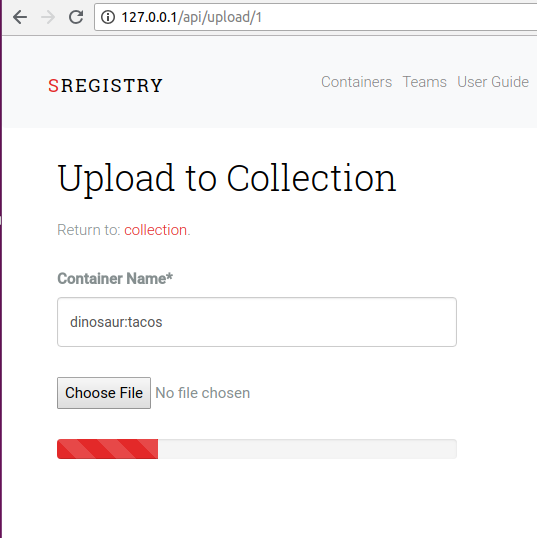
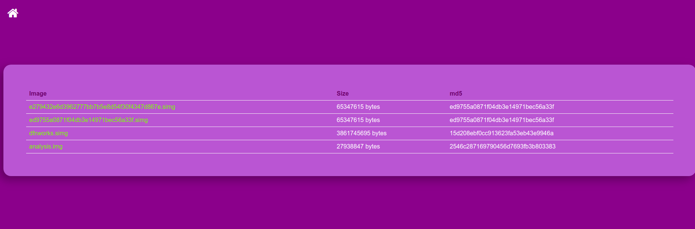

# Django Nginx Upload

The [nginx upload](https://www.nginx.com/resources/wiki/modules/upload/) module offers a nice way to bypass the Django application for file uploads.  This is an example Django application that 
demonstrates a basic setup with a custom nginx image and a webserver, both as Docker images for
deployment with docker compose.


## Rationale
I am creating this toy example after much frustration trying to implement (something) that would be able to handle uploads of [Singularity](https://singularityware.github.io) containers. Specifically, 
when you set up an nginx web server and you have file uploads, you usually need to set a maximum body
size so the server doesn't poop out:

```bash
  client_max_body_size 8000M;
  client_body_buffer_size 8000M;
  client_body_timeout 120;
```

It's a game we all play - when you first create the application, you forget to set this
entirely. At some point you get a suite of errors related to "this file is too big," you do a google
search, find that you can define the max body (and buffer and timeout) and add to your configuration.
But if you have REALLY big files, you can still have the configuration above, and have the upload fail.
Then you start looking for other solutions, and here we are!

There were several issues ([#108](https://github.com/singularityhub/sregistry/issues/108), [#109](https://github.com/singularityhub/sregistry/issues/109), [#123](https://github.com/singularityhub/sregistry/issues/123)) with discussion that ranged from using [chunked upload](https://github.com/juliomalegria/django-chunked-upload), and then this nginx module, and in retrospect you can read the issues to
see how I stumbled trying to find the best approach. I was so determined to make this easier for all future dinosaur programmers that I started working on it early one Saturday morning, and had an entire new thing (this repository) about 8 hours later. This is my dinosaur programmer superpower!


### Chunked Upload
The idea of a chunked upload speaks for itself - you break a file into chunks, and upload them separately instead of the entire thing in one go. This module to implement chunked uploading for Django worked beautifully in the browser, and if you need a good "out of the box" module this is a good approach. It was very easy for me to plug the uploader into a pretty progress bar, and my result looked like this:



The author was also very wise to provide an [example](https://github.com/juliomalegria/django-chunked-upload-demo). But getting the same functionality from the command line would be a series of hacks. I [posted an issue](https://github.com/juliomalegria/django-chunked-upload/issues/41) but did not get any response, even after many weeks. I think this solution could be very good if the work is extended to include an integration with django restful (or similar) for interaction from the command line.

### Chunk Upload (Restful)
Another user created a [django restful framework chunked upload](https://github.com/jkeifer/drf-chunked-upload) but did not provide substantial documentation to get it working. We [came very close](https://github.com/jkeifer/drf-chunked-upload/issues/6)
but I wasn't able to guess what the PUT or POST calls should look like, and I sensed we weren't going to progress very quickly. 

### Nginx Module
I at first didn't like the idea of having a file uploaded directly to my server, but actually
you can integrate authentication at several levels so my concern was assuaged. For this demo I won't
implement any kind of authentication, but I'll point you to resources to figure it out (I would
imagine the authentication schema / details would vary based on the use case).


# Usage

I've provided the application Dockerized so you don't need to install dependencies, beyond using Docker.
To bring up the server:

```bash
docker-compose up -d
```

Then to upload, you can use either the web interface or a command line utility [push.py](push.py)

## Web Interface

Then you can navigate to [http://127.0.0.1](http://127.0.0.1) to see the portal. It's the massive
purpely/pink box you see in the picture above! You can click or drop to add a file to upload.

When the file finishes uploading, you will see the table! You can always navigate back to the
main page by clicking the home icon in the upper left.



## Command Line

I wrote you a little client to push an image to your server! Here is the usage:

```bash
usage: push.py [-h] [--host HOST] [--port PORT] [--schema SCHEMA] file

Dinosaur Nginx Upload Example

positional arguments:
  file                  full path to file to push

optional arguments:
  -h, --help            show this help message and exit
  --host HOST           the host where the server is running
  --port PORT, -p PORT  the port where the server is running
  --schema SCHEMA, -s SCHEMA
                        http:// or https://
usage: push.py [-h] [--host HOST] [--port PORT] [--schema SCHEMA] file
push.py: error: the following arguments are required: file
```

You shouldn't need to change the host or port or schema given running the Docker containers
locally, but I've added those arguments in case you want to extend the script to some other 
server.

And here is an example to upload a container. Note that you will need requests and requests tool belt instlled.

```bash
pip install requests
pip install requests-toolbelt
```
```bash
./push.py /home/vanessa/dfnworks.simg 
PUSH /home/vanessa/dfnworks.simg
[3682 of 3682 MB]
[Return status 200 Upload Complete]
```

## Deployment
If you deploy this, there are some customizations you need to take into account!

 - **Authentication** is removed for this demo. You should add it back. You can add this at the level of the nginx module, or via a view for the application.
 - **https** of course this should be served with https. The server block is largely the same, but you would have another for port 443.

My preference for a lot of these scaled problems is to "outsource" to another service (e.g., use Google Storage and their APIs) but given that we still need to deploy local modular applications on our own filesystems, this seems like a reasonable solution. If you have any questions or need help, please don't be afraid to [reach out](https://www.github.com/vsoch/django-nginx-upload/issues). I hope that this is helpful for you!
